# StudioGhibli Library

## Índice

* [1. Resumen del proyecto](#1-resumen-del-proyecto)
* [2. Definición del producto](#2-definicion-del-producto)
* [3. Características del proyecto](#3-caracteristicas-del-proyecto)
* [4. Funcionalidad](#4-funcionalidad)
* [5. Prototipo](#5-prototipo)
* [6. Decisiones de diseño](#6-decisiones-de-diseño)
* [7. Interfaz de usuario](#7-interfaz-de-usuario)

***

## 1. Resumen del proyecto 📌

Studio Ghibli Library es un aplicativo web, el cual permite visualizar un conjuntos de datos de la filmografía Studio Ghibli. Estos datos se presentan de manera ordenada, facilitando la busqueda de lo que se desea observar.

## 2. Definición del producto 📝

### ¿Quiénes son los principales usuarios de producto?
-Seguidors de las películas de Studio Ghibli.
-Cualquiera que desee conocer datos importantes sobre Studio Ghibli.

### ¿Cuáles son los objetivos de estos usuarios en relación con tu producto?
Visualizar de manera sencilla los datos más importantes de Studio Ghibli. Tales como:
-Películas 🎞️
-Personajes 🙋‍♀️
-Puntajes en Rotten Tomatoes 🍅

### ¿Cómo crees que el producto que estás creando está resolviendo sus problemas?

Studio Ghibli Library nos permite ver los datos de manera ordenada y sencilla. Permitiendo reducir el tiempo de busqueda según la necesidad del usuario.

## 3. Características del proyecto ✅

El desarrollo del producto proyecto utiliza diversos métodos para mostrar los datos de preferencia del usuario. 

## 4. Funcionalidad ⚙️

Para su correcto funcionamiento el usuario debera elegir entre los métodos de filtrado y ordenado que se presentan en la interfaz, como:

-Filtrado de peliculas por director 
-Filtrado de peliculas por productor 
-Filtrado de personajes por peliculas
-Filtrado de personajes por especies
-Ordenado por puntajes Rotten Tomatoes
-Ordenado por años de estreno ascendente y descendente
-Ordenado por letras de abecedario

## 5. Prototipo ⚒️

*Prototipo baja fidelidad
## El prototipo inicial fue diseñado a mano 1️⃣

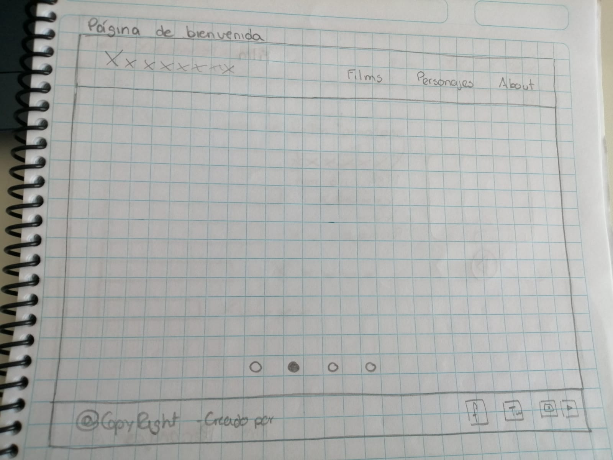
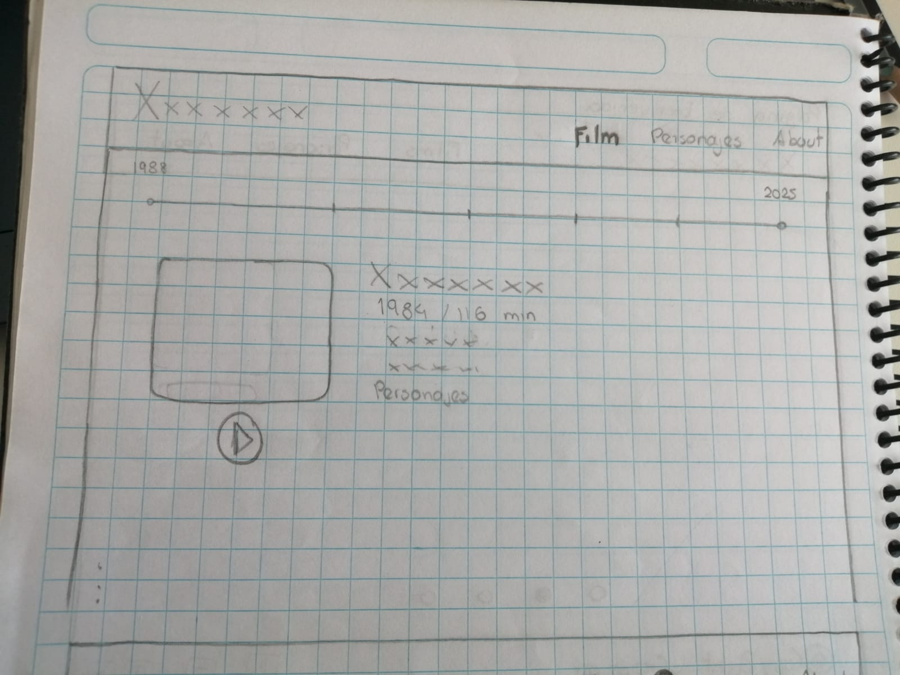
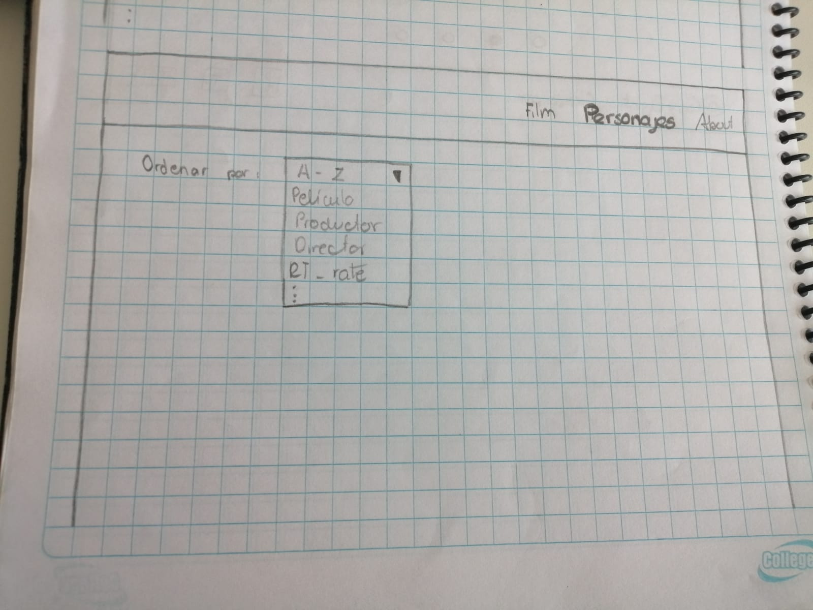
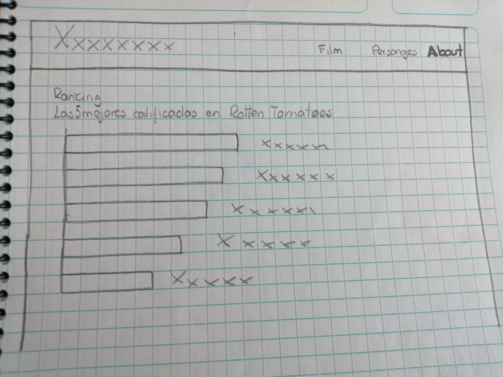

*Prototipo alta fidelidad
## El segundo prototipo fue diseñado con la herramienta Figma 2️⃣
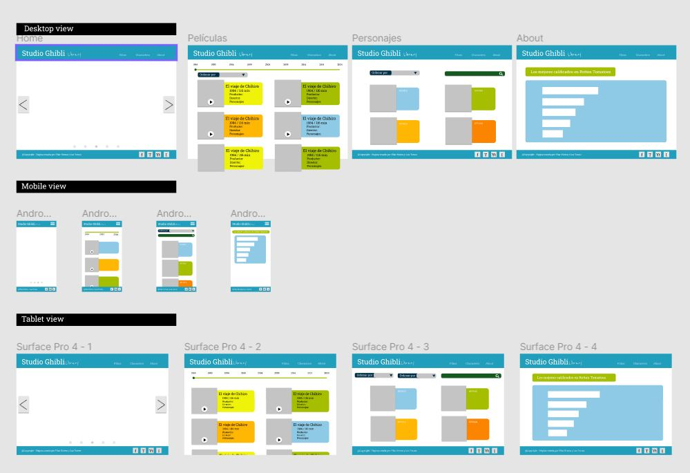

## 6. Decisiones de diseño 🎨

- Se utilizo el logo del largometraje y sus colores insignia.
- Se inserto un pie de página donde se muestran las redes sociales de Studio Ghibli.
- Se opto por implementar una interfaz intuitiva, presentando un diseño amigable y sencillo.

## 7. Interfaz de usuario 📱💻

La interfaz del usuario presenta un menú de navegación el cual ofrece las diferentes secciones con las que cuenta la pagina. También, un catálogo completo de las peliculas de Studio Ghibli. Del mismo modo cuenta con secciones que muestran los filtros que se puede utilizar para las busquedas.

## Interfaz final

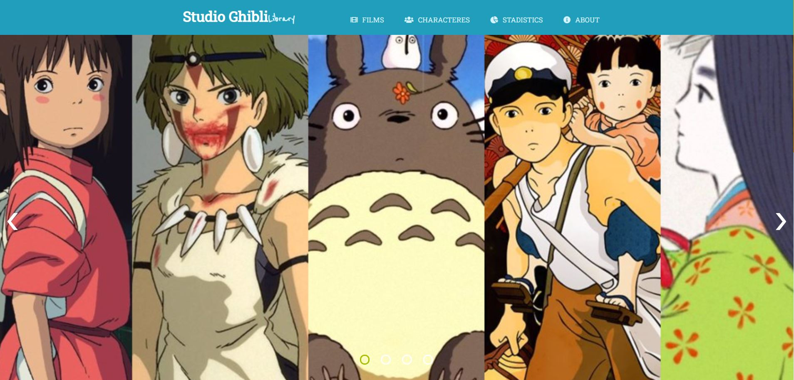

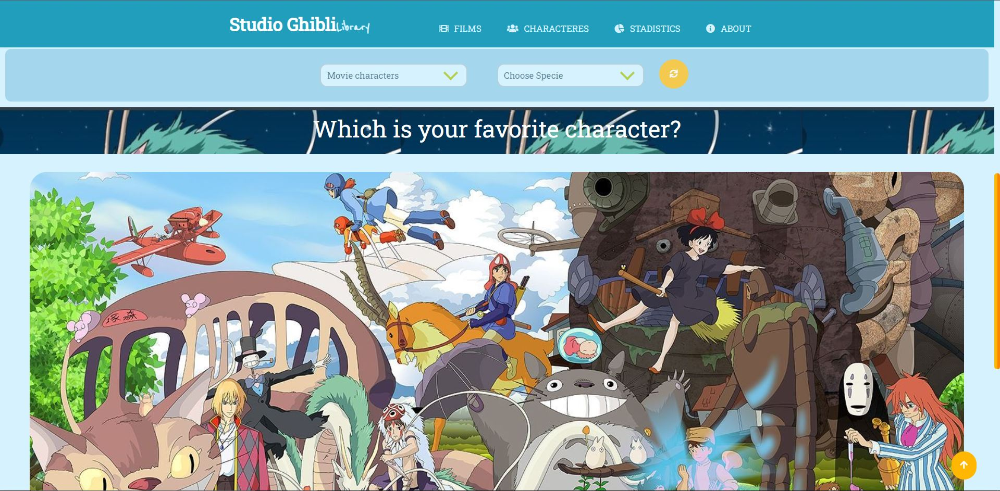
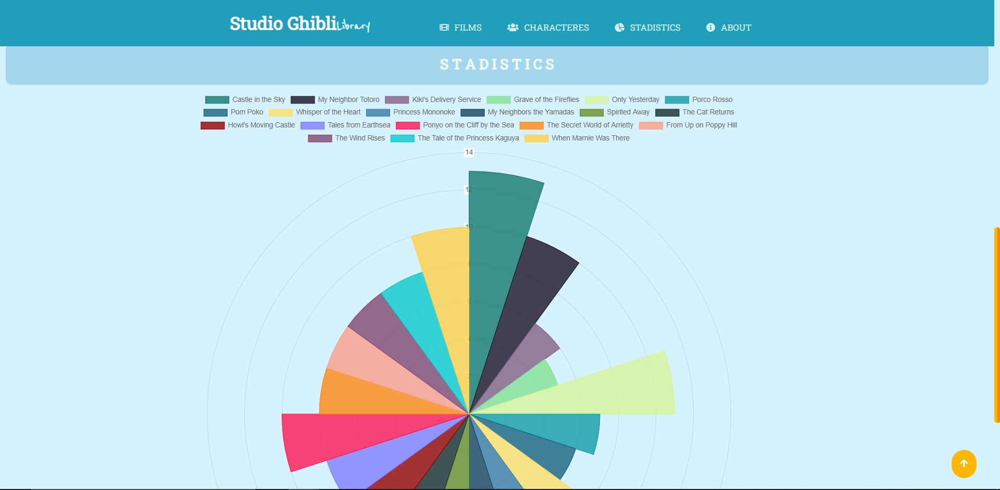
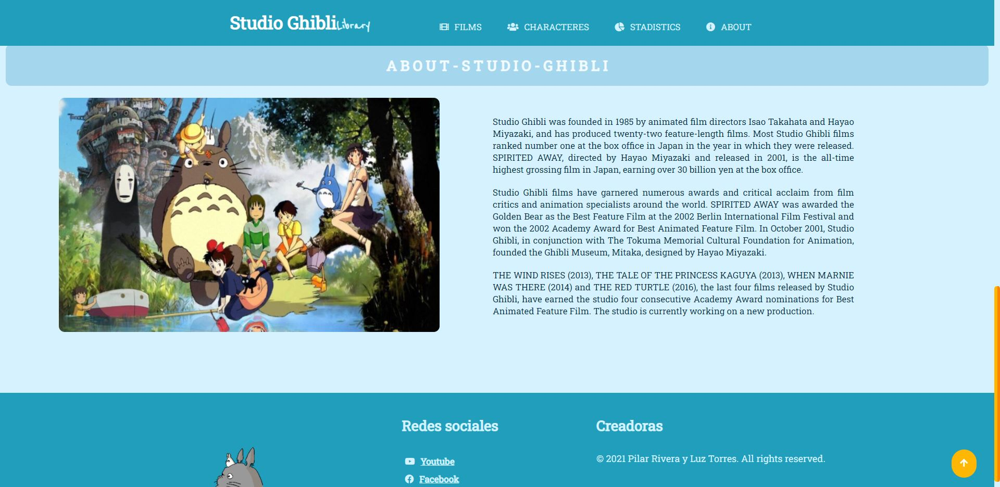
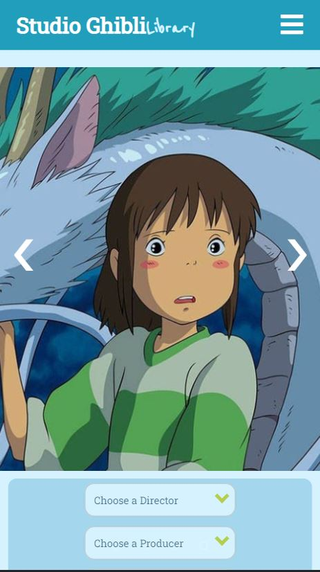
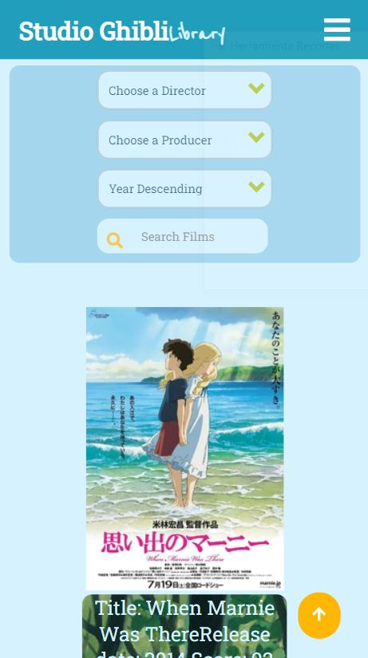
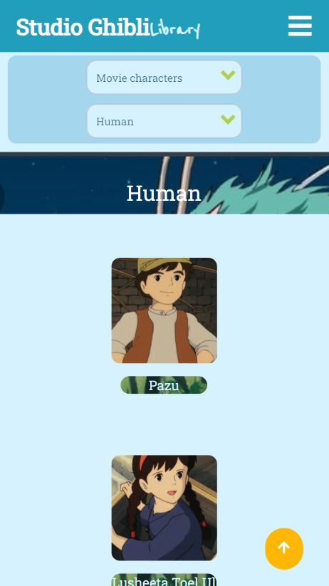
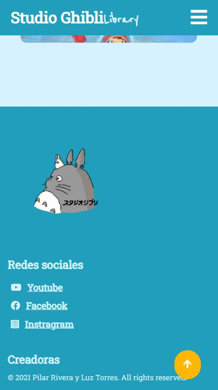
